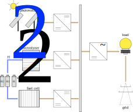
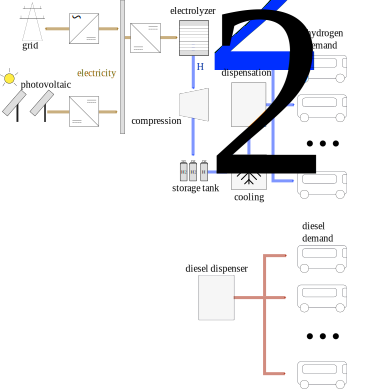

.. _lab:energysystemmodels:

Details on the energy system models
===================================

Hydrogen can be used as an energy carrier in several contexts. Among others,
power-to-power (reproduce electricity in fuel cell or gas turbine), power-to-mobility (hydrogen cars, buses, trucks etc.) and 
power-to-fuel (production of hydrogen, ammonia, methanol etc.) are typical valorization pathways. 
For each valorization pathway, an energy system model is presented in this section. 

..
	power-to-gas (injection in gas infrastructure), 
    and power-to-industry (decarbonize chemical sector
.. _lab:pvelectrolyzermodel:

Power-to-fuel
-------------

In the power-to-fuel model, a photovoltaic array is coupled to an electrolyzer stack through a DC-DC converter with Maximum Power Point Tracking (MPPT).
The electricity produced by the photovoltaic array is used to convert water into hydrogen and oxygen.

   The photovoltaic array is connected to the electrolyzer stack through a DC-DC converter with MPPT.
   
The photovoltaic array model and electrolyzer array model are adopted from the PVlib Python package :cite:`pvlib` and from Saeed et al. :cite:`Saeed2015`, respectively.
The DC-DC converter operates at 100% electrical efficiency and the lifetime of the electrolyzer array is determined based on the number of operating hours during the evaluated year.
For each system design, the Levelized Cost Of Hydrogen (LCOH) and the produced hydrogen, :math:`\dot{m}_{\mathrm{H}_2}`, are considered the main performance indicators.
The produced hydrogen is equal to the sum of the hourly produced hydrogen:

:math:`\dot{m}_{\mathrm{H}_2} = \sum_{i=1}^{8760} \dot{m}_{\mathrm{H}_2,i}`.

The LCOH presents the cost per kg of hydrogen covered:

:math:`\mathrm{LCOH} = \dfrac{ \mathrm{CAPEX}_\mathrm{a} + \mathrm{OPEX}_\mathrm{a} + R_\mathrm{c,a}   }{\dot{m}_{\mathrm{H}_2}}`,

where :math:`\mathrm{CAPEX}_\mathrm{a}` and :math:`\mathrm{OPEX}_\mathrm{a}` represent the annualized investment cost and annualized operational cost 
for the photovoltaic array, electrolyzer stack and DC-DC converter. :math:`R_\mathrm{c,a}` represents the annualized replacement cost for the electrolyzer array.
In addition to these two performance indicators, the lifetime of the electrolyzer, the photovoltaic electricity produced and consumed are quantified.
To select other model outputs as optimization objectives, we refer to :ref:`lab:wrapper`. 

To optimize these performance indicators, the capacity of the DC-DC inverter (:math:`\mathrm{n\_pv\_dcdc}`, :math:`\mathrm{kW}`) and the capacity of the electrolyzer array (:math:`\mathrm{n\_pemel}`, :math:`\mathrm{kW}`)
are configured as design variables by default, while the capacity of the photovoltaic array (:math:`\mathrm{n\_pv}`, :math:`\mathrm{kW}_\mathrm{p}`) is fixed. However, other design optimization
scenario's can be configured (e.g. optimize the capacity of the photovoltaic array and the electrolyzer array). To modify the design variables, we refer to :ref:`lab:stochasticdesignspace`.
To quantify the performance indicators, the model is characterized by several technical and economic parameters. These parameters can be considered stochastic 
(i.e. subject to uncertainty). The uncertainty on the annual solar irradiance (:math:`\mathrm{u\_sol\_irr}`) 
and the uncertainty on the annual average ambient temperature (:math:`\mathrm{u\_t\_amb}`) can be extracted from inter-annual variability.
The capital expenditures (CAPEX) on the photovoltaic array (:math:`\mathrm{capex\_pv}`), DC-DC converter (:math:`\mathrm{capex\_dcdc}`) and the CAPEX and 
replacement cost of the electrolyzer array (:math:`\mathrm{capex\_pemel}` and :math:`\mathrm{repl\_pemel}`, respectively) can be considered uncertain due to 
the significant timeframe between the design stage and investment stage and the evolving market conditions.
Due to commissioning and maintenance quality, the operating expenditures on the photovoltaic array (:math:`\mathrm{opex\_pv}`), 
DC-DC converter (:math:`\mathrm{opex\_dcdc}`) and the electrolyzer array (:math:`\mathrm{opex\_pemel}`) can be considered uncertain.
The interest rate (:math:`\mathrm{int\_rate}`) and inflation rate (:math:`\mathrm{infl\_rate}`) are considered uncertain based on the unknown finance type and unknown evolution of the inflation
over the system lifetime, respectively. Finally, the lifetime of the electrolyzer array is considered uncertain (:math:`\mathrm{life\_pemel}`) based on 
the lack of knowledge on the specific electrolyzer that will be adopted in the actual system.
More details on the characterization of the stochastic parameters are described by Coppitters et al. :cite:`coppitters2020robust`.
The following table lists the uncertainty characterization of the specific parameters described above.

.. list-table:: Stochastic space for the photovoltaic-electrolyzer system
   :widths: 40 40 40 30
   :header-rows: 1
   
   * - parameter
     - distribution
     - unit
     - reference
	 
   * - :math:`\mathrm{u\_sol\_irr}`
     - :math:`\mathcal{U}(90,110)` 
     - :math:`\% ~ \mathrm{of} ~ \mathrm{annual} ~ \mathrm{solar} ~ \mathrm{irradiance}`
     - :cite:`coppitters2020robust`

   * - :math:`\mathrm{u\_t\_amb}`
     - :math:`\mathcal{U}(-0.4,0.4)` 
     - :math:`\mathrm{deviation} ~ \mathrm{from} ~ \mathrm{annual} ~ \mathrm{average} ~ \mathrm{in} ~ \mathrm{K}`
     - :cite:`coppitters2020robust`
   
   * - :math:`\mathrm{capex\_pv}`
     - :math:`\mathcal{U}(350,600)`
     - :math:`{\large €} / \mathrm{kW}_\mathrm{p}`
     - :cite:`iea2019`

   * - :math:`\mathrm{opex\_pv}`
     - :math:`\mathcal{U}(16,19)`
     - :math:`{\large €} / \mathrm{kW}_\mathrm{p} / \mathrm{year}`
     - :cite:`coppitters2020robust`
	 
   * - :math:`\mathrm{capex\_pemel}`
     - :math:`\mathcal{U}(1400,2100)`
     - :math:`{\large €} / \mathrm{kW}`
     - :cite:`coppitters2020robust`

   * - :math:`\mathrm{opex\_pemel}`
     - :math:`\mathcal{U}(3,5)`
     - :math:`\% ~ \mathrm{of} ~ \mathrm{capex\_pemel}`
     - :cite:`coppitters2020robust`

   * - :math:`\mathrm{repl\_pemel}`
     - :math:`\mathcal{U}(15,20)`
     - :math:`\% ~ \mathrm{of} ~ \mathrm{capex\_pemel}`
     - :cite:`coppitters2020robust`

   * - :math:`\mathrm{life\_pemel}`
     - :math:`\mathcal{U}(60000,100000)`
     - :math:`\mathrm{operating} ~ \mathrm{hours}`
     - :cite:`coppitters2020robust`

   * - :math:`\mathrm{capex\_dcdc}`
     - :math:`\mathcal{U}(100,200)`
     - :math:`{\large €} / \mathrm{kW}`
     - :cite:`coppitters2020robust`

   * - :math:`\mathrm{opex\_dcdc}`
     - :math:`\mathcal{U}(1,5)`
     - :math:`\% ~ \mathrm{of} ~ \mathrm{capex\_dcdc}`
     - :cite:`coppitters2020robust`

   * - :math:`\mathrm{int\_rate}`
     - :math:`\mathcal{U}(0.04,0.08)`
     -
     - :cite:`coppitters2020robust`

   * - :math:`\mathrm{infl\_rate}`
     - :math:`\mathcal{U}(0.01,0.03)`
     -
     - :cite:`coppitters2020robust`

These uncertainties can be propagated through the system model, resulting in stochastic system outputs. The standard deviation of the system outputs, and the 
impact of these uncertainties on the standard deviation of the system outputs, can be quantified by applying the uncertainty quantification algorithm (see :ref:`lab:uncertaintyquantification`),
while the designs with optimized mean and the designs least-sensitive to these uncertainties can be found through robust design optimization (see :ref:`lab:runrdo`). 
Not all these parameters need to be considered stochastic during these evaluations (e.g. the CAPEX of the components can be considered deterministic). To determine 
which parameters are considered uncertain during the evaluation, we refer to :ref:`lab:stochasticdesignspace`.

Evaluating a single design can be performed as follows:

.. code-block:: python
    

   import os
   import rheia
   import rheia.CASES.H2_FUEL.h2_fuel as lb

   path = os.path.dirname(rheia.__file__)

   # the climate file considered
   filename_climate = os.path.join(path,
                                   'CASES',
                                   'DATA',
                                   'climate',
                                   'climate_Brussels.csv')

   # the object to read in the data
   my_data = lb.ReadData(filename_climate)

   # get the solar irradiance and ambient temperature
   sol_irr, t_amb = my_data.load_climate()

   # retrieve the deterministic values for the model parameters
   parameters = my_data.load_parameters()

   # define the design to be tested
   inputs = {'n_dcdc_pv': 5.,
             'n_pemel':   4.}

   # instantiate from the Evaluation class
   my_evaluation = lb.Evaluation(sol_irr, t_amb, {**parameters, **inputs})

   # evaluate the system
   my_evaluation.evaluation()

   # print the results
   my_evaluation.print_results()

.. _lab:pvh2model:

Power-to-power
--------------

The considered system is a grid-connected load, supported by a photovoltaic array and a hydrogen-based energy system. 
The grid is considered permanently available and able to cover the required power at any time of the year. 
The PV array is coupled to a DC bus bar through a DC-DC converter with Maximum Power Point Tracking. 
The hydrogen-based energy system consists of an electrolyzer stack, storage tank and fuel cell array. 
The electrolyzer array and fuel cell stack are integrated to store the excess of PV array electricity, while the fuel cell array 
generates electricity from the stored hydrogen when required. 
To transfer the DC electricity from the photovoltaic array and fuel cell array to the AC load, a DC-AC converter is connected.

.. _fig:pvh2scheme:

   The considered system includes the load connected to the grid and supported by a photovoltaic array and hydrogen-based energy system. 
   The hydrogen-based energy system (electrolyzer, fuel cell and storage tank) enable the system to store an excess of PV array electricity and to comply, up to the available energy, with the demand when the solar irradiance is insufficient.
 
To set the hierarchy between the subsystems, a typical power management strategy is implemented, which primarily aims to satisfy the demand. 
In this strategy, excess PV power (i.e. remaining PV power after complying with the power required by the load) is supplied to the electrolyzer stack. 
When the hydrogen tank is full, or when the surplus power lies outside the electrolyzer array operating range, 
the surplus energy is sold to the grid at the wholesale electricity price. In the opposite case, when the PV array does not cover the demand, the remaining demand is covered by the fuel cell array, 
if sufficient stored hydrogen is available and if the required power lies within the operating boundaries of the fuel cell array. If not, the grid covers the remaining demand.
The price for buying electricity from the grid depends on the wholesale electricity price and the fraction of the wholesale electricity price to the retail electricity price.

The photovoltaic array model and electrolyzer array model are adopted from the PVlib Python package :cite:`pvlib` and from Saeed et al. :cite:`Saeed2015`, respectively.
The fuel cell array model is adopted from Murugesan et al :cite:`murugesan2013investigation`. The DC-DC converters and DC-AC inverter operate at 100% electrical efficiency, 
and are sized based on the maximum power that passes through the component. The lifetime of the electrolyzer array and fuel cell array 
are determined based on the number of operating hours during the evaluated year.

To evaluate the techno-economic performance of the system, 
the Levelized Cost Of Electricity (LCOE) and Self-Sufficiency Ratio (SSR) are selected. 
The LCOE reflects the system cost per unit of electricity covered:

:math:`\mathrm{LCOE} = \dfrac{\mathrm{CAPEX}_\mathrm{a} + \mathrm{OPEX}_\mathrm{a} + R_\mathrm{c,a} +G_\mathrm{c,a} - G_\mathrm{s,a}}{ \sum_{i=0}^{8760} P_\mathrm{demand}}`.

To determine the system cost, the annualized investment cost of all components :math:`\mathrm{CAPEX}_\mathrm{a}`, annualized operational cost :math:`\mathrm{OPEX}_\mathrm{a}`, annualized replacement cost :math:`R_\mathrm{c,a}`, 
grid electricity cost :math:`G_\mathrm{c,a}` and the gain from selling excess electricity :math:`G_\mathrm{s,a}` are evaluated.
:math:`\sum_{i=0}^{8760} P_\mathrm{demand}` represents the annual electricity demand.  

To indicate the fraction of the load that is covered by the photovoltaic array and hydrogen-based system,
the Self-Sufficiency Ratio (SSR) is quantified as a secondary performance indicator:

:math:`\mathrm{SSR} = 1 - \dfrac{\sum_{i=0}^{8760} P_\mathrm{grid}}{\sum_{i=0}^{8760} P_\mathrm{demand}}`,

where :math:`\sum_{i=0}^{8760} P_\mathrm{grid}` is the demand covered by the grid. 
In addition to these performance indicators, additional model outputs are present, such as the amount of grid electricity sold and bought.
To select other model outputs as optimization objectives, we refer to :ref:`lab:wrapper`. 

To optimize these performance indicators, the capacity of the photovoltaic array (:math:`\mathrm{n\_pv}`, :math:`\mathrm{kW}_\mathrm{p}`), electrolyzer array (:math:`\mathrm{n\_pemel}`, :math:`\mathrm{kW}`),
hydrogen storage tank (:math:`\mathrm{n\_pemel}`, :math:`\mathrm{kWh}`) and fuel cell array (:math:`\mathrm{n\_pemfc}`, :math:`\mathrm{kW}`) are considered as
design variables. 

..
	The SSR is an important factor for adopters of HRES, as it illustrates the resilience against large electricity price increases and the protection against power cuts, 
	which are more likely in the future. Moreover, reaching a significant SSR threshold is beneficial for grid operators, as it reduces the simultaneous power extraction from the grid 
	and therefore reduces the risk of black-outs.

The uncertainty on the annual solar irradiance (:math:`\mathrm{u\_sol\_irr}`) 
and the uncertainty on the annual average ambient temperature (:math:`\mathrm{u\_t\_amb}`) can be extracted from inter-annual variability.
The uncertainty on the electric load (:math:`\mathrm{u\_load\_elec}`) is based on the unknown occupant behaviour.
The characterization of the grid electricity price depends on the wholesale electricity price (:math:`\mathrm{elec\_cost}`), the profit 
made by the distributor on this wholesale electricity price (:math:`\mathrm{elec\_cost\_profit}`) and the fraction of the retail electricity price that
is represented by the wholesale electricity price (:math:`\mathrm{elec\_cost\_ratio}`). To illustrate, when :math:`\mathrm{elec\_cost\_ratio}` corresponds
to 30%, then the final price for buying electricity from the grid depends for 30% on the wholesale electricity price and the profit made on this price, and for
70% on other factors, e.g. distribution costs and taxes. The uncertainty on these three parameters follows from the evolving energy mix, market conditions and
political decisions.
The capital expenditures (CAPEX) on the photovoltaic array (:math:`\mathrm{capex\_pv}`), the hydrogen storage tank (:math:`\mathrm{capex\_tank}`),
the DC-DC converters (:math:`\mathrm{capex\_dcdc}`), the DC-AC inverter (:math:`\mathrm{capex\_dcac}`) and the CAPEX and 
replacement cost of the electrolyzer array (:math:`\mathrm{capex\_pemel}` and :math:`\mathrm{repl\_pemel}`, respectively) 
and fuel cell array (:math:`\mathrm{capex\_pemfc}` and :math:`\mathrm{repl\_pemfc}`, respectively)
can be considered uncertain due to the significant timeframe between the design stage and investment stage and the evolving market conditions.
Due to commissioning and maintenance quality, the operating expenditures on the photovoltaic array (:math:`\mathrm{opex\_pv}`), 
DC-DC converter (:math:`\mathrm{opex\_dcdc}`), DC-AC inverter (:math:`\mathrm{opex\_dcac}`), electrolyzer array (:math:`\mathrm{opex\_pemel}`),
hydrogen storage tank (:math:`\mathrm{opex\_tank}`) and fuel cell array (:math:`\mathrm{opex\_pemfc}`) can be considered uncertain.
The interest rate (:math:`\mathrm{int\_rate}`) and inflation rate (:math:`\mathrm{infl\_rate}`) are considered uncertain based on the unknown finance type and unknown evolution of the inflation
over the system lifetime, respectively. Finally, the lifetime of the electrolyzer array and fuel cell array (:math:`\mathrm{life\_pemel}` and :math:`\mathrm{life\_pemfc}`, respectively) are 
considered uncertain based on the lack of knowledge on the specific electrolyzer that will be adopted in the actual system.
More details on the characterization of the stochastic parameters are described by Coppitters et al. :cite:`coppitters2020robust`.
The following table lists the uncertainty characterization of the specific parameters described above.

..
	The system model is subject to techno-economic uncertainty, which affect both the LCOE and SSR.
	Additionally, inter-annual variability is present on the electricity demand, solar irradiance and ambient temperature~\cite{Mavromatidis2018}.
	From an economic point of view, the system is subject to commissioning and maintenance quality, which affects the operating and maintenance cost, 
	uncertain replacement cost due to evolving market conditions and a highly-uncertain wholesale electricity price due to an evolving energy mix, 
	improved energy efficiency and increased electrification of fossil-based energy sectors.
	A change in the finance type of the project and a significant timeframe between the design stage and investment stage, 
	which increases the possibility for the market conditions to change between the stages, implies uncertainty on the interest rate and investment costs. 
	Therefore, the CAPEX and OPEX for each component (i.e. photovoltaic array, electrolyzer stack, hydrogen storage tank, fuel cell stack, DC-DC converters and DC-AC inverter) 
	are considered uncertain. In the case that the expected lifetime does not exceed the system lifetime, the lifetime and replacement cost are considered uncertain as well.

.. list-table:: Stochastic space for the photovoltaic-hydrogen system
   :widths: 40 40 40 30
   :header-rows: 1
   
   * - parameter
     - distribution
     - unit
     - reference
	 
   * - :math:`\mathrm{u\_sol\_irr}`
     - :math:`\mathcal{U}(90,110)` 
     - :math:`\% ~ \mathrm{of} ~ \mathrm{annual} ~ \mathrm{solar} ~ \mathrm{irradiance}`
     - :cite:`coppitters2020robust`

   * - :math:`\mathrm{u\_t\_amb}`
     - :math:`\mathcal{U}(-0.4,0.4)` 
     - :math:`\mathrm{deviation} ~ \mathrm{from} ~ \mathrm{annual} ~ \mathrm{average} ~ \mathrm{in} ~ \mathrm{K}`
     - :cite:`coppitters2020robust`

   * - :math:`\mathrm{u\_load\_elec}`
     - :math:`\mathcal{U}(80,120)` 
     - :math:`\% ~ \mathrm{of} ~ \mathrm{annual} ~ \mathrm{electric} ~ \mathrm{load}`
     - :cite:`Zhou2013`

   * - :math:`\mathrm{elec\_cost}`
     - :math:`\mathcal{U}(46,97)` 
     - :math:`{\large €} / \mathrm{MWh}`
     - :cite:`coppitters2020robust`

   * - :math:`\mathrm{elec\_cost\_profit}`
     - :math:`\mathcal{U}(15,25)` 
     - :math:`{\large €} / \mathrm{MWh}`
     - :cite:`coppitters2020robust`

   * - :math:`\mathrm{elec\_cost\_ratio}`
     - :math:`\mathcal{U}(20,40)` 
     - :math:`%`
     - :cite:`coppitters2020robust`
   
   * - :math:`\mathrm{capex\_pv}`
     - :math:`\mathcal{U}(350,600)`
     - :math:`{\large €} / \mathrm{kW}_\mathrm{p}`
     - :cite:`iea2019`

   * - :math:`\mathrm{opex\_pv}`
     - :math:`\mathcal{U}(16,19)`
     - :math:`{\large €} / \mathrm{kW}_\mathrm{p} / \mathrm{year}`
     - :cite:`coppitters2020robust`
	 
   * - :math:`\mathrm{capex\_pemel}`
     - :math:`\mathcal{U}(1400,2100)`
     - :math:`{\large €} / \mathrm{kW}`
     - :cite:`coppitters2020robust`

   * - :math:`\mathrm{opex\_pemel}`
     - :math:`\mathcal{U}(3,5)`
     - :math:`\% ~ \mathrm{of} ~ \mathrm{capex\_pemel}`
     - :cite:`coppitters2020robust`

   * - :math:`\mathrm{repl\_pemel}`
     - :math:`\mathcal{U}(15,20)`
     - :math:`\% ~ \mathrm{of} ~ \mathrm{capex\_pemel}`
     - :cite:`coppitters2020robust`

   * - :math:`\mathrm{life\_pemel}`
     - :math:`\mathcal{U}(60000,100000)`
     - :math:`\mathrm{operating} ~ \mathrm{hours}`
     - :cite:`coppitters2020robust`

   * - :math:`\mathrm{capex\_pemfc}`
     - :math:`\mathcal{U}(1500,2400)`
     - :math:`{\large €} / \mathrm{kW}`
     - :cite:`coppitters2020robust`

   * - :math:`\mathrm{opex\_pemfc}`
     - :math:`\mathcal{U}(0.045,0.135)`
     - :math:`{\large €} / \mathrm{h}`
     - :cite:`coppitters2020robust`

   * - :math:`\mathrm{repl\_pemfc}`
     - :math:`\mathcal{U}(25,30)`
     - :math:`\% ~ \mathrm{of} ~ \mathrm{capex\_pemfc}`
     - :cite:`coppitters2020robust`

   * - :math:`\mathrm{life\_pemfc}`
     - :math:`\mathcal{U}(20000,30000)`
     - :math:`\mathrm{operating} ~ \mathrm{hours}`
     - :cite:`coppitters2020robust`

   * - :math:`\mathrm{capex\_tank}`
     - :math:`\mathcal{U}(10.4,14.4)`
     - :math:`{\large €} / \mathrm{kWh}`
     - :cite:`coppitters2020robust`

   * - :math:`\mathrm{opex\_tank}`
     - :math:`\mathcal{U}(1,2)`
     - :math:`\% ~ \mathrm{of} ~ \mathrm{capex\_tank}`
     - :cite:`coppitters2020robust`

   * - :math:`\mathrm{capex\_dcdc}`
     - :math:`\mathcal{U}(100,200)`
     - :math:`{\large €} / \mathrm{kW}`
     - :cite:`coppitters2020robust`

   * - :math:`\mathrm{opex\_dcdc}`
     - :math:`\mathcal{U}(1,5)`
     - :math:`\% ~ \mathrm{of} ~ \mathrm{capex\_dcdc}`
     - :cite:`coppitters2020robust`

   * - :math:`\mathrm{int\_rate}`
     - :math:`\mathcal{U}(0.04,0.08)`
     -
     - :cite:`coppitters2020robust`

   * - :math:`\mathrm{infl\_rate}`
     - :math:`\mathcal{U}(0.01,0.03)`
     -
     - :cite:`coppitters2020robust`

These uncertainties can be propagated through the system model, resulting in stochastic system outputs. The standard deviation of the system outputs, and the 
impact of these uncertainties on the standard deviation of the system outputs, can be quantified by applying the uncertainty quantification algorithm (see :ref:`lab:uncertaintyquantification`),
while the designs with optimized mean and the designs least-sensitive to these uncertainties can be found through robust design optimization (see :ref:`lab:runrdo`). 
Not all these parameters need to be considered stochastic during these evaluations (e.g. the CAPEX of the components can be considered deterministic). To determine 
which parameters are considered uncertain during the evaluation, we refer to :ref:`lab:stochasticdesignspace`.

Evaluating a single design can be performed as follows:

.. code-block:: python
    
	
   import os
   import rheia
   import rheia.CASES.H2_POWER.h2_power as lb

   path = os.path.dirname(rheia.__file__)

   # the climate file considered
   filename_climate = os.path.join(path,
                                   'CASES',
                                   'DATA',
                                   'climate',
                                   'climate_Brussels.csv')

   filename_demand = os.path.join(path,
                                  'CASES',
                                  'DATA',
                                  'demand',
                                  'load_Brussels_dwelling.csv')

   # the object to read in the data
   my_data = lb.ReadData(filename_climate, filename_demand)
    
   # get the solar irradiance and ambient temperature
   sol_irr, t_amb = my_data.load_climate()

   # get the electric load
   load_elec = my_data.load_demand()

   # retrieve the deterministic values for the model parameters
   parameters = my_data.load_parameters()

   # define the design to be tested
   inputs = {'n_pv':    10.,
             'n_pemel': 2.,
             'n_pemfc': 1.,
             'n_tank':  100., 
             }

   # instantiate from the Evaluation class
   my_evaluation = lb.Evaluation(sol_irr, t_amb, load_elec, {**parameters, **inputs})

   # evaluate the system
   my_evaluation.evaluation()

   # print the results
   my_evaluation.print_results()

Power-to-mobility
-----------------

The mobility demand corresponds to a bus depot. The bus fleet at this depot can consist of
hydrogen-fueled buses (i.e.\ powered by a hydrogen fuel cell), diesel-fueled buses or a mix of both. To determine the
period in which these buses are fueled, the European daily bus refuelling profile is adopted :cite:`arya`.
The energy consumption for both bus types is determined based on the energy consumption per unit of distance covered.
To fuel the hydrogen-fueled buses, an on-site, grid-connected, hydrogen refueling station is considered. In this
hydrogen refueling station, a photovoltaic array is connected to a DC bus bar through a DC-DC converter with Maximum Power Point Tracking.
The hydrogen is generated, compressed and stored in a Proton Exchange Membrane electrolyzer array, compressor and storage tank, respectively.
Before dispensation, the hydrogen is cooled down in a cooling unit.      

.. _fig:pvmobscheme:

   The bus fleet can consist of hydrogen-fueled buses, diesel-fueled buses or a mix of both. 
   For the hydrogen-fueled buses, a grid-connected hydrogen refueling station is considered. 
   In the hydrogen refueling station, a photovoltaic array produces electricity to generate hydrogen in the electrolyzer. 
   The produced hydrogen is compressed and stored in storage tanks. Before the dispensation of the hydrogen, 
   the hydrogen is cooled down to 233 K to limit the temperature in the bus tank.

The power management strategy for the hydrogen refueling station aims to continuously comply with the mobility demand. 
During the refueling period, hydrogen is extracted from the storage tank. When the storage tank is empty and the hydrogen 
demand is not satisfied, the remaining hydrogen is produced instantaneously in the electrolyzer array, compressed, cooled and dispensed. 
To power the electrolyzer array, compression and cooling, first PV electricity is considered, followed by the power from the battery stack. 
When the PV electricity does not comply with the electricity demand, grid electricity is used to cover the remaining demand. 
Alternatively, when the storage tank is able to comply with the mobility demand, the PV electricity is used to
generate and compress hydrogen in the electrolyzer array and the compressor. The generated hydrogen is stored in the hydrogen storage tank. 
 
..
	At the bus depot, a typical amount of 50 buses are parked
	with an average utilisation rate of 250 km per bus per day
 
The photovoltaic array model and electrolyzer array model are adopted from the PVlib Python package :cite:`pvlib` and from Saeed et al. :cite:`Saeed2015`, respectively.
The DC-DC converters and DC-AC inverter operate at 100% electrical efficiency, and are sized based on the maximum power that passes through the component. 
The lifetime of the electrolyzer array is determined based on the number of operating hours during the evaluated year.

To evaluate the performance of the system, the Levelized Cost Of Driving (LCOD) and Carbon Intensity (CI) are selected. These performance indicators
indicate the techno-economic and environmental performance of the system.
The LCOD is presented as the annualized system cost over the annual distance travelled by the fleet:

:math:`\mathrm{LCOD} = \dfrac{\mathrm{CAPEX}_\mathrm{a} + \mathrm{OPEX}_\mathrm{a} + \mathrm{Repl}_\mathrm{a} + G_\mathrm{c,a} - G_\mathrm{s,a} + \mathrm{diesel}_\mathrm{a}}{D}`.

To determine the system cost, the annualized investment cost of all components :math:`\mathrm{CAPEX}_\mathrm{a}`, annualized operational cost :math:`\mathrm{OPEX}_\mathrm{a}`, annualized replacement cost :math:`R_\mathrm{c,a}`, 
grid electricity cost :math:`G_\mathrm{c,a}`, the gain from selling excess electricity :math:`G_\mathrm{s,a}` and the annual diesel cost to fuel the diesel-fueled buses :math:`\mathrm{diesel}_\mathrm{a}` are evaluated.
:math:`D` represents the annual distance travelled by the fleet.  

Similarly to the LCOD, the environmental performance indicator evaluates the annualized GHG emission of the system per unit of distance travelled by the bus fleet, 
i.e. Carbon Intensity (:math:`\mathrm{CI}`). The system GHG emissions represents the sum of the GHG emissions during construction of the components :math:`{\mathrm{GHG}}_\mathrm{comp,a}`, 
the GHG emissions from grid electricity consumption :math:`\mathrm{GHG}_\mathrm{grid,a}` and the well-to-wheel GHG emissions from diesel consumption :math:`\mathrm{GHG}_\mathrm{diesel,a}`:

:math:`\mathrm{CI} = \dfrac{{\mathrm{GHG}}_\mathrm{comp,a} + \mathrm{GHG}_\mathrm{grid,a} + \mathrm{GHG}_\mathrm{diesel,a}}{D}`.

In addition to these performance indicators, additional model outputs are present, such as the amount of grid electricity sold and bought.
To select other model outputs as optimization objectives, we refer to :ref:`lab:wrapper`. 

To optimize these performance indicators, the capacity of the photovoltaic array (:math:`\mathrm{n\_pv}`, :math:`\mathrm{kW}_\mathrm{p}`), electrolyzer array (:math:`\mathrm{n\_pemel}`, :math:`\mathrm{kW}`),
hydrogen storage tank (:math:`\mathrm{n\_pemel}`, :math:`\mathrm{kWh}`) and the number of buses fueled by hydrogen (:math:`\mathrm{n\_h2\_bus}`) are considered as
design variables. The capacity of the compressor and the cooling is quantified based on the highest hydrogen mass flow rate that is compressed and cooled during the evaluated year. 

In the default uncertainty characterization of this model in this framework, only the aleatory uncertainty on the model parameters is considered. 
The aleatory uncertainty represents the natural variation of the parameter and is therefore irreducible (i.e. the future evolution of the diesel price).
Hence, the epistemic uncertainty (i.e. the uncertainty that is characterized by lack of knowledge, and that can be reduced by gaining more information) is not considered.
The parameters affected by aleatory uncertainty are the grid electricity price, grid electricity GHG emissions, diesel price, energy consumption, 
annual solar irradiance, average ambient temperature and the inflation rate.
The uncertainty on the annual solar irradiance (:math:`\mathrm{u\_sol\_irr}`) 
and the uncertainty on the annual average ambient temperature (:math:`\mathrm{u\_t\_amb}`) can be extracted from inter-annual variability.
The characterization of the grid electricity price depends on the wholesale electricity price (:math:`\mathrm{elec\_cost}`), the profit 
made by the distributor on this wholesale electricity price (:math:`\mathrm{elec\_cost\_profit}`) and the fraction of the retail electricity price that
is represented by the wholesale electricity price (:math:`\mathrm{elec\_cost\_ratio}`). To illustrate, when :math:`\mathrm{elec\_cost\_ratio}` corresponds
to 30%, then the final price for buying electricity from the grid depends for 30% on the wholesale electricity price and the profit made on this price, and for
70% on other factors, e.g. distribution costs, taxes. The uncertainty on these three parameters follows from an evolving energy mix, market conditions and
political decisions.
Similar for the evolution of the diesel price (:math:`\mathrm{diesel\_cost}`) up to 2030, where the distribution integrates over low, middle and high diesel cost scenarios. 
For the transport consumption, the uncertainty on the energy consumption per kilometer for diesel-fueled (:math:`\mathrm{cons\_diesel\_bus}`) and 
hydrogen-fueled bus (:math:`\mathrm{cons\_h2\_bus}`) depends on the difference between predicted and real-world operating conditions.
The uncertainty on the specific GHG emission for grid electricity consumption depends on the scenarios for the evolution of the electricity mix.
The inflation rate (:math:`\mathrm{infl\_rate}`) is considered uncertain based on the unknown evolution of the inflation
over the system lifetime, respectively. 
The following table lists the uncertainty characterization of the specific parameters described above.

.. list-table:: Stochastic space for the photovoltaic-hydrogen system
   :widths: 40 40 40 30
   :header-rows: 1
   
   * - parameter
     - distribution
     - unit
     - reference
	 
   * - :math:`\mathrm{u\_sol\_irr}`
     - :math:`\mathcal{U}(90,110)` 
     - :math:`\% ~ \mathrm{of} ~ \mathrm{annual} ~ \mathrm{solar} ~ \mathrm{irradiance}`
     - :cite:`coppitters2020robust`

   * - :math:`\mathrm{u\_t\_amb}`
     - :math:`\mathcal{U}(-0.4,0.4)` 
     - :math:`\mathrm{deviation} ~ \mathrm{from} ~ \mathrm{annual} ~ \mathrm{average} ~ \mathrm{in} ~ \mathrm{K}`
     - :cite:`coppitters2020robust`

   * - :math:`\mathrm{elec\_cost}`
     - :math:`\mathcal{U}(46,97)` 
     - :math:`{\large €} / \mathrm{MWh}`
     - :cite:`coppitters2020robust`

   * - :math:`\mathrm{elec\_cost\_profit}`
     - :math:`\mathcal{U}(15,25)` 
     - :math:`{\large €} / \mathrm{MWh}`
     - :cite:`coppitters2020robust`

   * - :math:`\mathrm{elec\_cost\_ratio}`
     - :math:`\mathcal{U}(20,40)` 
     - :math:`%`
     - :cite:`coppitters2020robust`

   * - :math:`\mathrm{diesel\_cost}`
     - :math:`\mathcal{U}(1.42,2.31)` 
     - :math:`{\large €} / \mathrm{l}`
     - :cite:`duic2017eu28`

   * - :math:`\mathrm{cons\_diesel\_bus}`
     - :math:`\mathcal{U}(3.7,4.5)` 
     - :math:`\mathrm{kWh} / \mathrm{km}`
     - :cite:`frey2007comparing`

   * - :math:`\mathrm{cons\_h2\_bus}`
     - :math:`\mathcal{U}(3.0,3.2)` 
     - :math:`\mathrm{kWh} / \mathrm{km}`
     - :cite:`frey2007comparing`

   * - :math:`\mathrm{co2\_elec}`
     - :math:`\mathcal{U}(144,176)`
     - :math:`\mathrm{g}_{\mathrm{CO}_{2,\mathrm{eq}}} / \mathrm{kWh}`
     - :cite:`co2elecdata`

These uncertainties can be propagated through the system model, resulting in stochastic system outputs. The standard deviation of the system outputs, and the 
impact of these uncertainties on the standard deviation of the system outputs, can be quantified by applying the uncertainty quantification algorithm (see :ref:`lab:uncertaintyquantification`),
while the designs with optimized mean and the designs least-sensitive to these uncertainties can be found through robust design optimization (see :ref:`lab:runrdo`). 
Not all these parameters need to be considered stochastic during these evaluations (e.g. the CAPEX of the components can be considered deterministic). To determine 
which parameters are considered uncertain during the evaluation, we refer to :ref:`lab:stochasticdesignspace`.

Evaluating a single design can be performed as follows:

.. code-block:: python
    

   import os
   import rheia
   import rheia.CASES.H2_MOBILITY.h2_mobility as lb

   path = os.path.dirname(rheia.__file__)

   # the climate file considered
   filename_climate = os.path.join(path,
                                   'CASES',
                                   'DATA',
                                   'climate',
                                   'climate_Brussels.csv')

   # the object to read in the data
   my_data = lb.ReadData(filename_climate)

   # get the solar irradiance and ambient temperature
   sol_irr, t_amb = my_data.load_climate()

   # retrieve the deterministic values for the model parameters
   parameters = my_data.load_parameters()

   # define the design to be tested
   inputs = {'n_pv':     1000.,
             'n_pemel':  2000.,
             'n_tank':   10000., 
             'n_h2_bus': 1.,
             }

   # instantiate from the Evaluation class
   my_evaluation = lb.Evaluation(sol_irr, t_amb, {**parameters, **inputs})

   # evaluate the system
   my_evaluation.evaluation()

   # print the results
   my_evaluation.print_results()

..
	Power-to-industry
	-----------------

	renewable ammonia production

	Power-to-gas
	------------

	not yet decided

Climate and demand data
-----------------------

The system performance depends on the climate and if present, on the electricity demand and heating demand.
As the energy demand is affected by the weather (i.e. space heating demand correlates with the ambient temperature and solar irradiance), 
the analysis should be conducted with climate data that corresponds to the energy demand profiles. 
Therefore, we adopt the `Typical Meteorological Year data <https://nsrdb.nrel.gov/data-sets/archives.html>`_ and
`hourly electricity demand data <https://openei.org/datasets/dataset/commercial-and-residential-hourly-load-profiles-for-all-tmy3-locations-in-the-united-states>`_ provided by the National Renewable Energy Laboratory,
as the former is used to construct the latter. As these databases contain information only on locations in the United States of America,
`Codeminders <http://www.codeminders.com/weather_similarity/>`_ allows identifying the location in the United States of America with similar climate conditions than for the location of interest.
In addition to the difference in climate, the cultural differences between the location in the USA and the location of interest affects the demand as well. To take into account these cultural differences, the electricity demand profile from the location in the USA is scaled, based on the annual electricity demand for the location of interest, provided by `Odysee-Mure <https://www.odyssee-mure.eu/publications/efficiency-by-sector/households/electricity-consumption-dwelling.html>`_ (for European locations).
The method of converting the demand to the specified location has been presented by Montero Carrero et al. :cite:`Engine2019` and is summarized as follows:

- Decide your location of interest (e.g. Brussels, Belgium);
- Find the corresponding location in the USA with a similar climate via `Codeminders <http://www.codeminders.com/weather_similarity/>`_ (e.g. for Brussels, Olympia has a 99% overlap);
- `Get the Typical Meteorological Year data <https://nsrdb.nrel.gov/data-sets/archives.html>`_ for the location in the USA (e.g. Olympia);
-  `Get the hourly electricity demand data <https://openei.org/datasets/dataset/commercial-and-residential-hourly-load-profiles-for-all-tmy3-locations-in-the-united-states>`_ for the location in the USA (e.g. Olympia);
- Scale the hourly demand profile with the average annual demand for the location of interest (for European locations, the `Odysee-Mure <https://www.odyssee-mure.eu/publications/efficiency-by-sector/households/electricity-consumption-dwelling.html>`_ database can be used);
- Convert the climate data and demand data file formats according to the climate and demand data files present in :file:`CASES\\DATA\\climate` and :file:`CASES\\DATA\\demand`, respectively.
- Add the climate data and demand data to :file:`CASES\\DATA\\climate` and :file:`CASES\\DATA\\demand`, respectively.

In the provided hydrogen-based energy systems, the yearly annual solar irradiance is provided as a model parameter in the form of a relative number to the provided yearly annual solar irradiance. In other words, characterizing :py:data:`sol_irr` with 1 in :file:`design_space` results 
in a yearly annual solar irradiance equal to the sum of the hourly solar irradiance values provided in the dataset for the specific location.
If the value is different (or subjected to uncertainty), all hourly solar irradiance values are scaled accordingly.

The characterization of the energy demand in :file:`design_space` is similar. This enables the user to scale the typical demand profiles for a specific location
based on the number of demands (e.g. a community of 500 dwellings).

The locations with climate and demand data currently present in RHEIA:

.. list-table:: Climate data and energy demand data 
   :widths: 40 40 40 40
   :header-rows: 1
   
   * - location
     - annual solar irradiance [kWh/m\ :sup:`2`\]
     - average annual ambient temperature [°C]
     - household electricity demand [MWh/year]
	 
   * - Brussels
     - 1188 
     - 10.4
     - 3.98

   * - Paris
     - 1240 
     - 11.2
     - 5.35

   * - Madrid
     - 1803 
     - 15.5
     - 4.04

