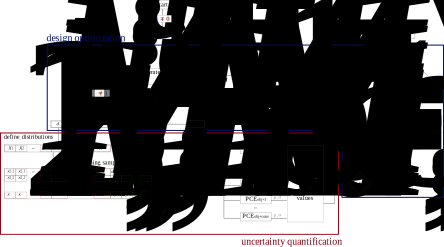

.. _lab:methods:

Details on the methods
======================

A brief backround, including some math when necessary ,for the different methods used in RHEIA, is provided below.

Uncertainty quantification
--------------------------

Uncertainty quantification is performed using, the Polynomial Chaos Expansion method is applied in RHEIA. 
In the section below, the method is briefly introduced. Additional details on the method are provided by Sudret et al. :cite:`Sudret2014`. 

.. _lab:pce:

Polynomial Chaos Expansion
^^^^^^^^^^^^^^^^^^^^^^^^^^

The Polynomial Chaos Expansion (PCE) representation of the model under consideration consists of a series of orthogonal polynomials :math:`\Psi_i` with corresponding coefficients :math:`u_i`:

:math:`\mathcal{M}^{\mathrm{PCE}}(\pmb{X}) = \sum_{\pmb{\alpha} \in \mathcal{A}} u_{\pmb{\alpha}} \Psi_{\pmb{\alpha}} (\pmb{X}) \approx \mathcal{M}(\pmb{X})`, 

where :math:`\pmb{\alpha}` are the multi-indices and :math:`\mathcal{A}` is the considered set of multi-indices, for which the size is defined by a truncation scheme. 
The polynomial family that is orthogonal with respect to the assigned probability distributions are known for classic distributions. 
As an example, uniformly distributed stochastic input parameters associate with the Legendre polynomials.
A typical truncation scheme is adopted, which limits the polynomial order up to a certain degree. This constrains the number of multi-indices in the set to:

:math:`|\mathcal{A}^{M,p}| = \dfrac{(p + M)!}{p!M!}`,

where :math:`p` corresponds to the polynomial order and :math:`M = |\pmb{X}|` is the stochastic dimension, i.e. number of uncertainties (parameters and variables).
Consequently, :math:`|\mathcal{A}^{M,p}|` coefficients are present in a full PCE. To quantify these coefficients, least-square minimization is applied, based on actual system model evaluations. 
To ensure a well-posed Least-Square Minimization, :math:`2|\mathcal{A}^{M,p}|` model evaluations are required. 
When the coefficients are quantified, the mean (:math:`\mu`) and standard deviation (:math:`\sigma`) of the model output of interested are analytically derived:

:math:`\mu = u_0`,

:math:`\sigma^2 = \sum_{i=1}^P u_i^2`.

Next to these statistical moments, the contribution of each stochastic parameter to the variance of the model outputs provides valuable information on the model behavior under uncertainties. 
Generally, this contribution is quantified through Sobol' indices. 
Hence, the total-order Sobol' indices enable to perform a global sensitivity analysis on the stochastic parameters
PCE provides an analytical solution to quantify these Sobol' indices through post-processing of the coefficients (i.e. no additional model evaluations required). 
The total-order Sobol' indices (:math:`S_i^{T,\mathrm{PC}}`) quantify the total impact of a stochastic input parameter, including all mutual interactions. 

:math:`S_i^{T,\mathrm{PC}} = \sum_{\alpha \in A_i^T}^{} u_\alpha^2/\sum_{i=1}^P u_i^2 ~~~~~~ A_i^T = \{\alpha \in A | \alpha_i > 0\}`.

For every coefficient that is characterized by considering input parameter :math:`i`, among others, at an order :math:`> 0` is added to the total Sobol' index :math:`S_i`.

Optimization
------------

The Nondominated Sorting Genetic Algorithm (NSGA-II) is adopted to perform the deterministic and robust design optimization task. In the latter case, NSGA-II is coupled to PCE method in order to propagate the uncertaintes for each set of model parameters captured by the optimizer.
A brief introduction to the algorithm is provided below. The details on the method are described in :cite:`Deb2002a`.
Finally, a guideline towards setting the optimization parameters is provided, based on our experience.

.. _lab:ssnsga2:

NSGA-II
^^^^^^^

NSGA-II is a multi-objective genetic algorithm, suitable for optimization of complex, non-linear models :cite:`Deb2002a`. 
First, this algorithm creates a set of design samples (i.e. population), based on a Design of Experiment (DoE) scheme. In the case of RHEIA, Latin Hypercube Sampling is used. 
Thereafter, a second population (i.e. children) is generated with characteristics based on the previous population (i.e. parents), 
following crossover and mutation rules. Each design sample out of both populations is evaluated in the model (deterministic design optimization) 
or a PCE is constructed for each quantity of interest (robust design optimization). 
The populations are sorted based on the Pareto dominance relations. The top half of the sorted samples remain and represent the next population. 
The algorithm continues until the maximum number of iterations is realized. When the process is finalized, either the solution corresponds to a single design sample, 
which achieves the optimized value for all model outputs considered, or a set of optimized design samples where each sample dominates every other design sample in at least one output (i.e. Pareto front).

.. _lab:choosepop:

Configuring NSGA-II
^^^^^^^^^^^^^^^^^^^^^^^^^^^^

The computational budget and population size are fixed by the user. Both parameters provide an indication of the number of generations performed,
i.e. number of generations >= computational budget / population size. The population is spread over the design space. The higher the population size,
the higher the exploration of the design space. On the one hand, when the population size is small and the the number of mutations are limited, the population
might converge to a local optimum. On the other hand, when the population size is large, a significant computational budget is spent at each generation,
which limits the exploitation and might result in suboptimal designs. There is no strict rule on the population size, as it highly depends on the number of design variables,
the non-linearity of the input-output relation in the model and the number of local optima present in this relation.
Nevertheless, based on our experience in engineering optimization (i.e. <10 design variables), the population size is suggested between 20 and 50. Below 20, the possibility of ending in a
local optimum is significant, while a population size larger than 50 does not add significant improvement in design space exploration as opposed to the increase in cost per generation.
Moreover, it is suggested to define the population size based on the number of CPUs available. To illustrate, when 4 CPUs are available, considering defining the population size at 20, 24, 28, 32, ...
such that the CPUs are used at all time during the deterministic design optimization (in robust design optimization, the parallelization is performed on the samples for the PCE, for which the number of samples
is defined by the truncation scheme). 
To ensure sufficient exploitation, we suggest to reach a number of generations of at least 75 generations. Above 250 generations, the gain in exploitation becomes limited. However, keep always in mind that such values are drawn from our experience in a certain range of models, and it is not our intention to generalize them over the broad spectrum of engineering modelling.   

The probability of crossover and mutation are user-defined constants which support the exploitation and exploration, respectively.
As a good practice, the crossover probability is at least 0.85, while the probability of mutation usually remains below 0.1. Users with a priori knowledge on the model behaviour and its characteristics, are encouraged to adjust those values, in order to achieve maximum performance of NSGA-II in a particular case.

.. _lab:rdoprocedure:

Robust design optimization procedure
------------------------------------

The surrogate-assisted RDO algorithm consists of NSGA-II to perform the optimization, while PCE is applied on each design sample to provide the statistical moments as fitness values. 
Like in NSGA-II, the first step consists of generating a first population of design samples. 
For each design sample in this first population, a PCE is constructed for each quantity of interest. 
To illustrate, if the optimization problem consists of two quantities of interest (e.g.\ the efficiency and total cost of a system), 
then two PCEs are created to quantify the mean and standard deviation for each quantity of interest. 
To quantify the coefficients for each PCE, a set of random samples is generated, based on the distributions of the random parameters. 
These random samples are evaluated in the deterministic model and in the basis functions in the information matrix. Out of the coefficients, 
the mean and standard deviation is derived. Note that only one set of training samples is required to generate all the required PCEs for a design sample, 
as each sample generates a value for each quantity of interest. Thus, for each design sample, the fitness values are defined.
Out of the initial population, an offspring is created, for which the same procedure is applied: a PCE is created for each quantity of interest and 
the corresponding mean and standard deviation are stored as fitness values. 
When the mean and standard deviation values are quantified for each design sample in the uncertainty quantification inner loop, 
the design samples in the population and offspring are ranked based on their dominance in the objectives. 
The top half of the design samples lead to the next generation of design samples. Out of this new generation, 
offsprings are again created and the new population and offspring are again ranked, leading to the next generation. 
This process is repeated until the computational budget is spent. 

   The surrogate-assisted robust design optimization algorithm. After the generation of the offspring, 
   a design sample :math:`\pmb{d}_i` is selected out of the offspring, which contains :math:`a+b` values. 
   Design variables :math:`d_{1},...,d_{a}` are considered uncertain, which means that the values in :math:`d_{i,1},...,d_{i,a}` are used as mean value for the distributions :math:`X_{i,M-a+1},...,X_{i,M}`. 
   From the :math:`M` distributions, the training samples are generated and each training sample is appended with the values from the deterministic design variables :math:`d_{i,a+1},...,d_{i,b}`. 
   After evaluating the training samples in the deterministic model, the fitness values and constraint values (i.e. mean :math:`\mu$` and standard deviation :math:`\sigma` from each PCE) are stored. 
   This process is repeated until all :math:`N` design samples in :math:`Q_t` are processed. 
   The offspring :math:`Q_t` is combined with the population :math:`P_t` and the new population :math:`P_{t+1}` is generated using the NSGA-II selection procedure. 
   As long as the user-defined computational budget is not spent, a new offspring is generated and the entire process is repeated. 
   Note that for the first iteration, :math:`P_0` is empty and the offspring :math:`Q_0` is generated. 
   After going through the uncertainty quantification loop, :math:`P_1 = P_0`.