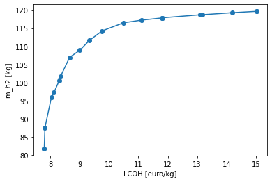
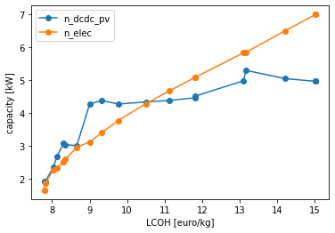
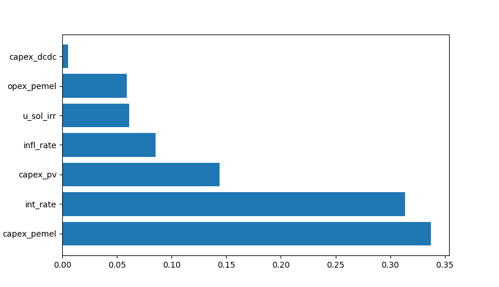
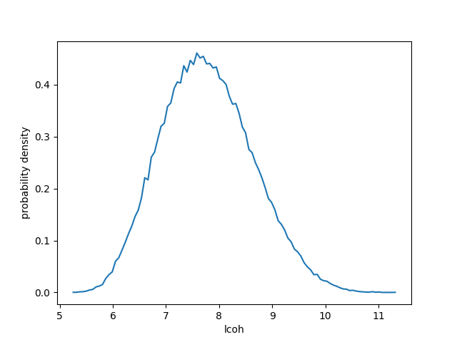

.. _lab:tutorial:

Tutorial
========

In this tutorial, the capabilities of the implemented deterministic design optimization, robust design optimization and uncertainty quantification procedures
are demonstrated on a photovoltaic-electrolyzer system. 
The system model evaluates the levelized cost of hydrogen and hydrogen production of a photovoltaic array coupled to an electrolyzer stack. 
This coupling is realised through DC-DC converters. Additional details on the system operation are presented in :ref:`lab:pvelectrolyzermodel`.

Deterministic design optimization
---------------------------------

For a fixed photovoltaic array of :math:`5~\mathrm{kW}_\mathrm{p}`, the capacity of the electrolyzer stack and the capacity of the DC-DC converter 
can be designed such that the Levelized Cost Of Hydrogen (:math:`\mathrm{LCOH}`) and hydrogen production :math:`\dot{m}_{\mathrm{H}_2}` are optimized.
The bounds for the design variables and the values for the model parameters can be adjusted in :file:`CASES\\H2_FUEL\\design_space`.
Detailed information on characterizing the design variables is available in :ref:`lab:ssdesignspace`.

To perform a deterministic design optimization, the following optimization dictionary has to be filled and passed as an argument to the :py:func:`run_opt` function. 

.. code-block:: python
   :linenos:

   import rheia.OPT.optimization as rheia_opt
   import multiprocessing as mp

   dict_opt = {'case':                'H2_FUEL',
               'objectives':          {'DET': (-1, 1)}, 
               'stop':                ('BUDGET', 2000),
               'n jobs':              int(mp.cpu_count() / 2), 
               'population size':     20,
               'results dir':         'run_1',
               }

   if __name__ == '__main__':
       rheia_opt.run_opt(dict_opt)

In the dictionary, the case folder name :py:data:`'H2_FUEL'` is provided, followed by the optimization type :py:data:`'DET'` and the weigths for both objectives, 
i.e. minimization for the first returned objective :py:data:`lcoh` and maximization for the second returned objective :py:data:`m_h2`. 
A computational budget of 2000 model evaluations is selected as stopping criterion and the number of available physical cores are used
to parallelize the evaluations. The population contains 20 samples and the population and fitness values for each generation 
are saved in the folder :py:data:`'run_1'`. 
As Latin Hypercube Sampling is selected for the characterization of the population and the NSGA-II characteristics are equal to
the default settings, these specific items are not mentioned in the optimization dictionary.  
To run the optimization, the :py:func:`run_opt` function is called.
More information on defining the values for these NSGA-II parameters are illustrated in :ref:`lab:choosepop`. 
The detailed explanation for each item in the dictionary is described in :ref:`lab:optimization`.
	
When the run is complete (i.e. the computational budget is spent), the results are saved in :file:`RESULTS\\PV_ELEC\\DET\\run_1`.
**To save time in this tutorial, results are already provided in** :file:`RESULTS\\PV_ELEC\\DET\\run_tutorial`.
Also, due to the fact that the NSGA-II algorithm does not ensure mathematical optimality, the results stored in the tutorial
might differ slightly from the ones obtained with this run.
The objectives and the corresponding inputs are plotted in function of the LCOH (for the results stored in :file:`run_tutorial`): 

.. code-block:: python
   :linenos:

   import rheia.POST_PROCESS.lib_post_process as rheia_pp
   import matplotlib.pyplot as plt

   case = 'H2_FUEL'

   eval_type = 'DET'

   my_opt_plot = rheia_pp.PostProcessOpt(case, eval_type)

   result_dir = 'run_tutorial'

   y, x = my_opt_plot.get_fitness_population(result_dir)

   plt.plot(y[0], y[1], '-o')
   plt.xlabel('LCOH [euro/kg]')
   plt.ylabel('m_h2 [kg]')
   plt.show()

   for x_in in x:
       plt.plot(y[0], x_in, '-o')
   plt.legend(['n_dcdc_pv', 'n_elec'])
   plt.xlabel('LCOH [euro/kg]')
   plt.ylabel('capacity [kW]')
   plt.show()

In this code block, a :py:class:`post_process` instance is instantiated first, followed by an :py:class:`optimization_plot` instance which contains 
specific information on the optimization results. The fitness values and design samples can be plotted for the final generation 
through the :py:meth:`get_fitness_population()` method. This method enables to print out the Pareto front and the design variables 
on the same x-axis (LCOH).

   A trade-off exists between minimizing the LCOH and maximizing the hydrogen production. 
   

     
   The capacities of the system components increases gradually to improve the hydrogen production, at the expense of an increase in LCOH.
	
Robust design optimization
--------------------------

The robust design optimization procedure simultaneously minimizes the mean and standard deviation of a quantity of interest.
These statistical moments are quantified following the propagation of the input parameter uncertainties.
The stochastic input parameters are characterized in the :file:`CASES\\H2_FUEL\\stochastic_space` file. 
More information on the construction of :file:`stochastic_space` is found in :ref:`lab:ssstochastic_space`.
	
Determination of the polynomial order
^^^^^^^^^^^^^^^^^^^^^^^^^^^^^^^^^^^^^

Based on the PCE truncation scheme (see :ref:`lab:pce`), the number of model evaluations required to construct a PCE for each design sample
corresponds to 26, 182 and 910 for a maximum polynomial degree of 1,2 and 3, respectively. The polynomial degree
that leads to an accurate expansion is not known a priori and should, therefore, be determined iteratively. 
We refer to :ref:`lab:detpolorder` for more details on this method.

.. code-block:: python
   :linenos:

   import rheia.UQ.uncertainty_quantification as rheia_uq
   import multiprocessing as mp

   case = 'H2_FUEL'

   n_des_var = 20

   var_dict = rheia_uq.get_design_variables(case)

   X = rheia_uq.set_design_samples(var_dict, n_des_var)

   for iteration, x in enumerate(X):
       rheia_uq.write_design_space(case, iteration, var_dict, x)
       dict_uq = {'case':                  case,
                  'n jobs':                int(mp.cpu_count()/2),
                  'pol order':             1,
                  'objective names':       ['LCOH','mh2'],
                  'objective of interest': 'LCOH',
                  'results dir':           'sample_tutorial_%i' %iteration      
                  }   
       if __name__ == '__main__':
           rheia_uq.run_uq(dict_uq, design_space = 'design_space_tutorial_%i' %iteration)

The functions :py:func:`get_design_variables` and :py:func:`set_design_samples`
are used to collect the bounds of the design variables and to generate the samples through Latin Hypercube Sampling, respectively.
Then, :file:`design_space` files are created through :py:func:`write_design_space` 
-- one for each design sample -- and a PCE is constructed for each sample. 
At first, a polynomial degree of 1 is selected for evaluation.

**For this tutorial, results were generated in advance and stored in** :file:`RESULTS\\PV_ELEC\\UQ\\sample_tutorial_0` ... :file:`\\sample_tutorial_19`.
To determine the worst-case LOO error for the 20 design samples, a :py:class:`post_process_uq` class object is instantiated, 
followed by the call of the :py:meth:`get_loo` method:

.. code-block:: python
   :linenos:

   import rheia.POST_PROCESS.lib_post_process as rheia_pp

   case = 'H2_FUEL'

   pol_order = 1

   my_post_process_uq = rheia_pp.PostProcessUQ(case, pol_order)

   result_dirs = ['sample_tutorial_%i' %i for i in range(20)]

   objective = 'LCOH'

   loo = [0]*20
   for index, result_dir in enumerate(result_dirs):
       loo[index] = my_post_process_uq.get_loo(result_dir, objective)

   print(max(loo))
 
For the samples provided within the framework (i.e. :file:`\\sample_tutorial_0` ... :file:`\\sample_tutorial_19`) and a maximum polynomial order 1, 
the worst-case LOO error is 0.0701.
Increasing the polynomial order to 2 and generating the PCE for the same design samples
decreases the worst-case LOO error down to 0.0140. 
For this tutorial, this worst-case LOO error is considered acceptable. Hence, a maximum polynomial degree of 2 is selected for the PCE truncation scheme
during the robust design optimization.

Reducing the stochastic dimension
^^^^^^^^^^^^^^^^^^^^^^^^^^^^^^^^^

From the 20 samples generated to determine the polynomial order, also the Sobol' indices can be analyzed.
Based on these Sobol' indices, the stochastic parameters with little contribution to the standard deviation 
of the :math:`\mathrm{LCOH}` can be identified. These parameters can be considered deterministic with a 
negligible loss in accuracy on the :math:`\mathrm{LCOH}` mean and standard deviation during the robust design optimization.
The details on this method are provided in :ref:`lab:detpolorder`. 

For a polynomial order of 2, the stochastic parameters with a negligible Sobol' index can be identified as follows:

.. code-block:: python
   :linenos:

   import rheia.POST_PROCESS.lib_post_process as rheia_pp

   case = 'H2_FUEL'

   pol_order = 2

   my_post_process_uq = rheia_pp.PostProcessUQ(case, pol_order)

   result_dirs = ['sample_tutorial_%i' %i for i in range(20)]

   objective = 'LCOH'

   my_post_process_uq.get_max_sobol(result_dirs, objective, threshold=1./12.)	

A threshold for the Sobol' index is set at 1/12 (= 1/number of uncertain parameters).
5 out of 12 stochastic parameters have a maximum Sobol' index below the threshold, 
which indicates that these parameters can be considered deterministic without losing significant accuracy on the calculated statistical moments of the LCOH.
This reduction results in a decrease of 60% in computational cost, as only 72 model evaluations are required to 
construct a PCE for 7 uncertain parameters in the current truncation scheme, as opposed to 182 model evaluations with 12 uncertain parameters. 
Thus, by following this strategy, the 5 parameters with negligible contribution can be removed from :file:`stochastic_space`.

.. warning::
	As the accuracy of this method depends mainly on the number of design samples considered, the results are only indicative.
	Therefore, the stochastic parameters with negligible Sobol' index are not removed automatically. It is suggested to evaluate the feasibility of
	this result, based on the knowledge of the user on the considered system model. To illustrate, the uncertainty on the annual average ambient
	temperature has a negligible Sobol' index. This can be considered realistic, as the ambient temperature only slightly affects the power output
	of the photovoltaic array. 

Run a robust design optimization
^^^^^^^^^^^^^^^^^^^^^^^^^^^^^^^^

After the determination of the polynomial degree and the reduction of the stochastic dimension, the robust design optimization can be performed.
The code is similar than for the deterministic design optimization procedure. The details on running a robust design optimization are presented in
:ref:`lab:runrdo`.

.. code-block:: python
   :linenos:

   import rheia.OPT.optimization as rheia_opt
   import multiprocessing as mp

   dict_opt = {'case':                  'H2_FUEL',
               'objectives':            {'ROB': (-1, -1)}, 
               'stop':                  ('BUDGET', 72000),
               'n jobs':                int(mp.cpu_count() / 2), 
               'population size':       20,
               'results dir':           'run_1',
               'pol order':             2,
               'objective names':       ['LCOH', 'mh2'],
               'objective of interest': ['LCOH'],
               }

   if __name__ == '__main__':
       rheia_opt.run_opt(dict_opt)

Again, a population of 20 samples is selected. 
With 72 model evaluations required per design sample, a computational budget of 72000 is selected to reach at least 50 generations.
**The results for the tutorial are provided in** :file:`RESULTS\\PV_ELEC\\ROB\\run_tutorial`.
Similar to the deterministic design optimization, the optimization results can be plotted as follows (note that :py:data:`eval_type` has changed into :py:data:`'ROB'`):

.. code-block:: python
   :linenos:

   import rheia.POST_PROCESS.lib_post_process as rheia_pp
   import matplotlib.pyplot as plt

   case = 'H2_FUEL'

   eval_type = 'ROB'

   my_opt_plot = rheia_pp.PostProcessOpt(case, eval_type)

   result_dir = 'run_tutorial'

   y, x = my_opt_plot.get_fitness_population(result_dir)

   plt.plot(y[0], y[1], '-o')
   plt.xlabel('LCOH mean [euro/kg]')
   plt.ylabel('LCOH standard deviation [euro/kg]')
   plt.show()

   for x_in in x:
       plt.plot(y[0], x_in, '-o')
   plt.legend(['n_dcdc_pv', 'n_elec'])
   plt.xlabel('LCOH mean [euro/kg]')
   plt.ylabel('LCOH standard deviation [euro/kg]')
   plt.show()

The results show a single design, which indicates that there is no trade-off between minimizing the LCOH mean and minimizing the LCOH standard deviation.
The optimized design corresponds to a PV DC-DC converter of :math:`1.68 \mathrm{kW}` and an electrolyzer array of :math:`1.68 \mathrm{kW}`. 
The design achieves an LCOH mean of :math:`7.78 \mathrm{euro} / \mathrm{kg}_{\mathrm{H}_2}` and a LCOH standard deviation of :math:`0.85 \mathrm{euro} / \mathrm{kg}_{\mathrm{H}_2}`. 

Uncertainty quantification
--------------------------

Following the robust design optimization, a single optimized design is characterized that optimizes both mean and standard deviation of the LCOH.
The Sobol' indices for this design can illustrate the main drivers of the uncertainty on the LCOH, which can provide guidelines 
to effectively reduce the uncertainty by gathering more information on the dominant parameters.
To evaluate the Sobol' indices of this design, the design design variables should be transformed in the following model parameters in :file:`design_space`::

	n_dcdc_pv   par 1.68
	n_elec      par 1.68

This file can be saved as e.g. :file:`design_space_uq`, to avoid losing the configuration for optimization.
The uncertainty quantification dictionary is then characterized and evaluated as follows:

.. code-block:: python
   :linenos:

   import rheia.UQ.uncertainty_quantification as rheia_uq
   import multiprocessing as mp

   dict_uq = {'case':                  'H2_FUEL',
              'n jobs':                int(mp.cpu_count()/2),
              'pol order':             2,
              'objective names':       ['lcoh','mh2'],
              'objective of interest': 'lcoh',
              'draw pdf cdf':          [True, 1e5],
              'results dir':           'opt_design_tutorial'      
              }  

   if __name__ == '__main__':
       rheia_uq.run_uq(dict_uq, design_space = 'design_space_tutorial_uq')

For this tutorial, the results of the uncertainty quantification are provided in :file:`RESULTS\\PV_ELEC\\UQ\\opt_design_tutorial`

The resulting Sobol' indices can be plotted in a bar chart:

.. code-block:: python
   :linenos:

   import rheia.POST_PROCESS.lib_post_process as rheia_pp
   import matplotlib.pyplot as plt

   case = 'H2_FUEL'

   pol_order = 2

   my_post_process_uq = rheia_pp.PostProcessUQ(case, pol_order)

   result_dir = 'opt_design_tutorial'

   objective = 'lcoh'

   names, sobol = my_post_process_uq.get_sobol(result_dir, objective)

   plt.barh(names, sobol)
   plt.show()

The Sobol' indices illustrate that the uncertainty on the interest rate and the investment cost of the PV array and electrolyzer stack
dominate the uncertainty on the LCOH. 

Finally, the probability density function is plotted with the :py:meth:`get_pdf` method:

.. code-block:: python
   :lineno-start: 20

   x_pdf, y_pdf = my_post_process_uq.get_pdf(result_dir, objective)

   plt.plot(x_pdf, y_pdf)
   plt.xlabel('lcoh')
   plt.ylabel('probability density')
   plt.show()

    

